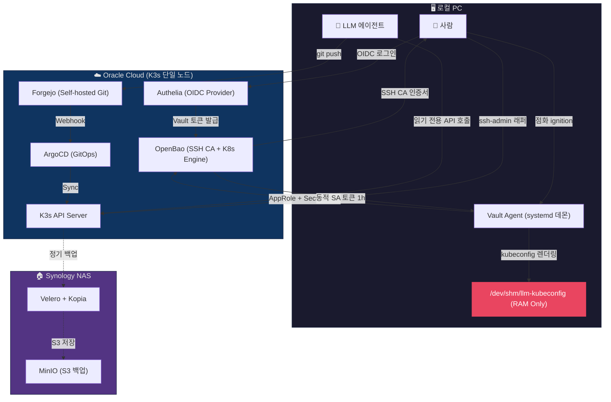
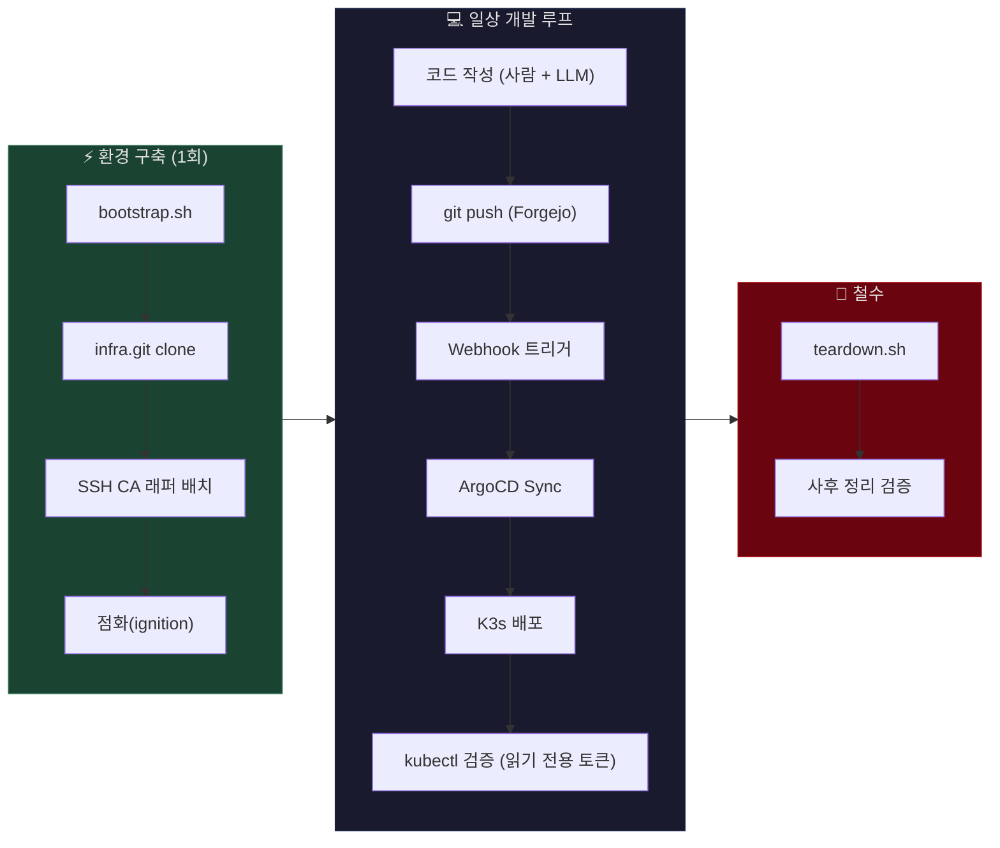

<div align="right">
  <a href="README.md">🇺🇸 English</a> | <b>🇰🇷 한국어</b>
</div>

# 🗄️ caged-dev-env

> **AI 에이전트의 의도치 않은 시스템 조작을 구조적으로 차단하는 단일 스크립트 기반 K3s 개발 환경**

환경: Oracle Cloud Always-Free ARM 인스턴스 (4 OCPU, 24GB RAM) + Synology NAS (백업/스토리지)
목표: VPN 없이 퍼블릭 네트워크에서 안전하게 운영 가능한 K3s 인프라 구축. LLM 코딩 에이전트에게 인프라 제어권을 조건부로 개방하되, 의도치 않은 시스템 조작을 구조적으로 차단할 것.

> ⚠️ **이 리포지토리는 시크릿을 제거한 쇼케이스 버전입니다.** 실제 운영 코드는 자체 호스팅 Forgejo에서 관리되며, 모든 플레이스홀더(`<YOUR_...>`)는 의도적으로 마스킹 처리되어 있습니다.

---

## 🚀 Quick Start

USB나 영구 설정 파일이 필요하지 않습니다. 초기 상태의 로컬 PC에서 터미널 하나만 열면 됩니다. 부트스트랩에 필요한 자격증명(Vault 주소, RoleID 등)은 비밀번호 관리자에서 조회합니다.

```bash
# <YOUR_GITHUB_RAW_URL>을 본인의 GitHub raw URL로 교체
curl -sL <YOUR_GITHUB_RAW_URL>/scripts/bootstrap.sh -o /tmp/bootstrap.sh
bash /tmp/bootstrap.sh
```

스크립트가 순서대로 물어봅니다 (환경변수로 미리 설정되어 있으면 자동 스킵):
1. **Vault 서버 주소** — OpenBao가 돌고 있는 도메인
2. **Forgejo 주소** — 자체 호스팅 Git 서버
3. **Forgejo llm-bot 토큰** — HTTPS clone용 (1회성, 저장하지 않음)
4. **AppRole RoleID** — LLM 에이전트용 Vault 인증 식별자

입력이 끝나면 스크립트가 자동으로:
- OS 감지 및 의존성 설치 (bao CLI, kubectl, jq)
- HTTPS로 infra 리포 clone (SSH CA 없이도 가능한 2단계 부트스트랩)
- SSH 키페어 생성 (YubiKey 감지 시 ed25519-sk 제안)
- SSH CA 래퍼(`ssh-admin`) 및 LLM 전용 래퍼(`ssh-llm`) 배치
- Vault Agent systemd 유닛 배치
- Git remote 자동 등록 (사람용 `git-admin` + LLM 전용 `git-llm`)
- Git config 기본값 설정 (초기 상태의 PC 대응)
- OIDC 인증 → 점화(ignition) → 1시간 TTL 동적 K8s 토큰 발급
- LLM SSH CA 인증서 자동 발급 (`valid_principals: llm-agent,llm-bot`)
- **E2E 자동 검증**: kubectl 접근, RBAC 차단, 인증 identity, git push dry-run (4/4 통과)

작업이 끝나면 `teardown.sh`로 남는 파일 없이 깔끔하게 철수합니다.
심볼릭 링크, 댕글링 참조까지 검증하는 사후 정리 검증(Audit)을 자동 수행합니다.

---

## 🛡️ 핵심 설계 사상

### 1. 구조(Schema)와 값(Value)의 분리

LLM에게는 매니페스트의 구조(YAML 키명, Helm 차트 템플릿)만 노출한다. 실제 시크릿 값은 OpenBao에 저장되며, ExternalSecret Operator가 런타임에 K8s Secret으로 주입한다. LLM은 `ExternalSecret` 매니페스트에서 어떤 키를 참조하는지는 알지만, 실제 비밀번호나 토큰 값에는 접근할 수 없다. 2차 방어선으로, LLM 에이전트의 ClusterRole에서 `secrets` 리소스 조회 자체를 RBAC으로 차단하여, K8s API 경유의 시크릿 열람도 차단한다.

### 2. 사람과 기계의 인증 파이프라인 분리

```
사람:  Authelia OIDC → OpenBao 로그인 → SSH CA 인증서 발급 → ssh-admin 래퍼 → 서버 kubectl
기계:  AppRole(1h SecretID) → OpenBao 토큰 → K8s Secrets Engine → 동적 SA 토큰 → 제한된 K8s API
```

사람의 관리 작업은 SSH를 통해 서버에서 직접 수행하므로, 외부 랩탑에 admin kubeconfig가 존재하지 않는다. LLM에게 발급되는 동적 SA 토큰은 `llm-agent-readonly` ClusterRole에 바인딩되어 읽기 전용이며, TTL 1시간 후 자동 소멸한다.

LLM 에이전트가 K8s API에 접근하려면, 사람이 OIDC 인증 후 점화 스크립트를 실행하여 1시간짜리 시한부 SecretID를 주입해야 한다. 이 수동 활성화(점화) 전제 구조는 사람의 명시적 승인 없이 M2M 파이프라인이 기동되지 않도록 강제한다.

### 3. 최소 권한과 휘발성

- K8s 토큰은 `/dev/shm`(tmpfs)에만 존재 — 디스크에 기록되지 않음
- 전 인증 체인 TTL 1시간 통일 (SecretID, Vault Token, K8s SA Token)
- SSH CA 인증서: LLM 전용 role은 `permit-port-forwarding` 미포함 → 내부 서비스 피버팅 차단
- 사람용 SSH 키를 `root:root` 소유로 설정 — 동일 OS 유저 세션의 LLM이 사람 자격증명을 읽는 것을 커널 수준에서 차단
- LLM 에이전트는 전용 SSH 래퍼(`ssh-llm`)를 통해 제한된 인증서로만 서버에 접속하지만, 전용 경로 장애 시 사람의 SSH 키를 탈취하여 풀 권한으로 우회한 사례가 있었다. 이를 차단하기 위해 `unshare --mount`로 사람 키를 LLM 프로세스에서 비가시화하고, `SSH_AUTH_SOCK`을 제거하여 SSH Agent 경유 접근도 차단한다
- 부트스트랩에 필요한 초기 자격증명(RoleID, Forgejo 토큰)은 대역 외(Out-of-band) 경로로 전달되며, 스크립트 실행 후 로컬에 잔류하지 않는다
- 사람의 admin SSH CA 인증서는 평시 삭제(`rm`)하여 최소 권한을 유지하고, 인프라 변경이 필요할 때만 OIDC 인증을 통해 1시간짜리 인증서를 재발급받는 에스컨레이션 방식으로 운용한다

---

## 🏗️ 시스템 아키텍처



### 개발 워크플로우 (CI/CD)



| 역할 | 기술 스택 | 선택 근거 |
|------|-----------|-----------|
| Orchestration | K3s | 단일 바이너리, ARM64 네이티브, 24GB 내 컨트롤+워커 동시 구동 |
| Identity/SSO | Authelia | ~50MB RAM, 파일 기반 GitOps 친화, Traefik ForwardAuth 네이티브 |
| Secret Mgmt | OpenBao (Vault fork) | MPL-2.0 오픈소스, API 100% Vault 호환, 동적 시크릿+SSH CA |
| GitOps | ArgoCD + Forgejo | Git을 Single Source of Truth로, 커밋 즉시 Webhook 동기화 |
| Backup | Velero + Kopia + MinIO | K8s 리소스 스냅샷 + S3 호환 스토리지, NAS 이중화 |
| TLS | cert-manager | Let's Encrypt DNS-01 Cloudflare, NAS 인증서 Pull 동기화 |

### 왜 Docker Compose가 아닌 K8s인가

Docker는 소켓 접근 시 권한 세분화가 불가능하다(all-or-nothing). "이 에이전트는 읽기만 가능" 같은 제한을 걸 수 없다. K8s는 API 앞에 RBAC 레이어가 존재하므로, 에이전트별로 네임스페이스·동사(get/list/delete) 단위의 권한 분리가 가능하다. LLM에게 인프라 제어권을 조건부로 개방하려면 RBAC이 전제 조건이었다.

---

## 💥 장애와 극복 (Incident Learnings)

운영 중 발생한 주요 인시던트의 분석과 아키텍처 교정 기록이다.

| 인시던트 | 요약 | 교정 |
|----------|------|------|
| LLM 에이전트의 의도치 않은 시스템 조작 예측 방어 | RBAC 없이 LLM에게 전체 권한이 열려 있는 구조적 결함 | 구조와 값의 분리 및 읽기 전용 ClusterRole 적용 |
| 로컬 admin kubeconfig를 통한 RBAC 우회 | 동일 환경에 admin kubeconfig와 제한된 토큰이 공존하여 에이전트가 관리자 설정을 직접 사용 가능 | SSH 래퍼(`ssh-admin`)로 admin 접속 격리 + 동적 M2M 파이프라인 도입 + 사람 SSH 키 `root:root` 소유권 격리 |
| LLM의 사람용 SSH 키 탈취 (Credential Escalation) | 전용 인증 경로 장애 시 에이전트가 사람 키로 우회하여 풀 권한 행사 | `unshare --mount` 마운트 네임스페이스 격리 + `root:root` 파일 소유권 + SSH Agent 소켓 차단 |
| K8s Secret Annotation 평문 누수 | 트러블슈팅 중 `last-applied-configuration` 어노테이션에서 평문 시크릿을 육안으로 포착 (Secondary Discovery) | `kubectl apply` 금지, ExternalSecret 전면 전환 |
| Velero Restic 백업의 침묵의 실패 | Lock Contention으로 백업이 성공으로 보고되나 실제 미수행 | Kopia 엔진 전환 + DB 논리 덤프 이중화 |

각 인시던트는 발견 경위, 근본 원인 분석, 아키텍처 교정, 재발 방지 조치를 포함한다. 상세 분석은 [`docs/incidents.md`](docs/incidents.md)를 참고한다.

---

## 🚧 설계상의 한계 및 향후 계획

- **LLM IDE에 대한 구조적 의존성**: 이 아키텍처에서는 Kustomize 구조 설계, Ingress 디버깅 등 인프라 운영의 반복적 작업에 LLM 코딩 에이전트를 활용하여 생산성을 높이고 있다. Claude Code 등 주요 LLM IDE를 비교 검토한 결과, 인프라 운영에 필요한 장기 컨텍스트 유지와 SSH/kubectl 등 외부 도구 연동 측면에서 Antigravity를 채택했다. 다만 어느 도구이든 빅테크의 상용 서비스에 의존하므로, 서비스 중단이나 가격 변경 시 LLM 기반 운영 환경이 성립하지 않을 수 있다. 코어 인프라(K3s, ArgoCD, OpenBao)는 LLM 없이도 독립적으로 동작하며, LLM IDE 시장의 경쟁 구도를 고려하면 대체재 전환은 가능하다.
- **Audit/Observability 미구현**: 권한 격리(RBAC, TTL)를 통해 LLM이 사고를 칠 범위는 통제했지만, "에이전트가 허용된 시간 동안 어떤 명령어를 쳤고 무슨 데이터를 읽었는가"를 사후에 추적할 블랙박스가 아직 없다. 실제로 Secret Annotation 평문 누수를 육안으로 우연히 발견한 경험이, 체계적인 감사 로그 없이는 보안 결함을 운에 의존할 수밖에 없다는 한계를 인식하게 된 계기였다. 향후 K8s API 감사 정책과 OpenBao 로그를 연동할 계획이다.
- **LLM 컨텍스트 오염 문제**: 세션 초반의 권한 위반 행동이 컨텍스트에 "성공 사례"로 남아, 이후 동일 패턴이 반복되는 행동 드리프트를 관찰함. 프롬프트 기반 규칙은 컨텍스트 길이에 반비례하여 희석되므로, OS 레벨 강제(`unshare`)가 필수적이라는 결론.
- **단일 노드**: 컨트롤 플레인과 워커가 동일 노드에서 구동되므로, 노드 장애 시 전체 클러스터가 중단된다. Velero 백업 기반의 복구 절차로 대응한다.

---

## 📂 리포지토리 구조

```
caged-dev-env/
├── README.md                          # Project overview (English)
├── README-ko.md                       # 프로젝트 개요 (한국어)
├── configs/                           # 선언적 설정 파일 (Vault, K8s RBAC, systemd)
│   ├── kubeconfig.ctmpl               #   Vault Agent → kubeconfig 렌더링 템플릿
│   ├── llm-agent-clusterrole.yaml     #   LLM 에이전트 읽기 전용 ClusterRole
│   ├── vault-agent.hcl                #   Vault Agent AppRole 자동 인증 설정
│   └── vault-agent.service            #   systemd 유닛 (데몬 관리)
├── scripts/                           # 실행 스크립트 (부트스트랩, 인증, 철수)
│   ├── bootstrap.sh                   #   단일 스크립트 환경 구축
│   ├── ignite-llm.sh                  #   LLM M2M 인증 파이프라인 점화
│   ├── ssh-admin.sh                   #   사람용 SSH CA 래퍼 (OIDC → 인증서 → 접속)
│   ├── ssh-llm.sh                     #   LLM용 SSH CA 래퍼 (포트포워딩 차단)
│   └── teardown.sh                    #   사후 정리 및 철수
└── docs/                              # 운영 문서
    ├── incidents.md                   #   인시던트 분석 및 아키텍처 교정 기록
    ├── infrastructure.md              #   인프라 구성도
    └── tech-decisions.md              #   기술 선정 근거 (트레이드오프 분석)
```
