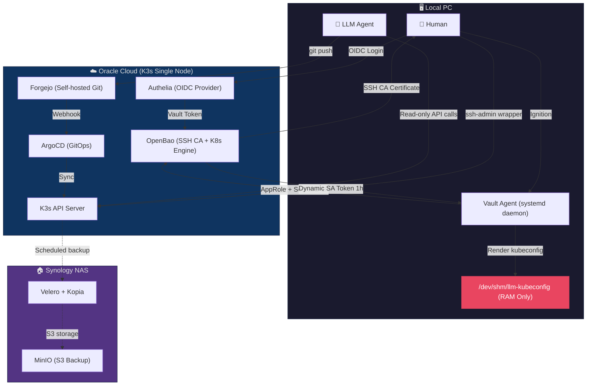
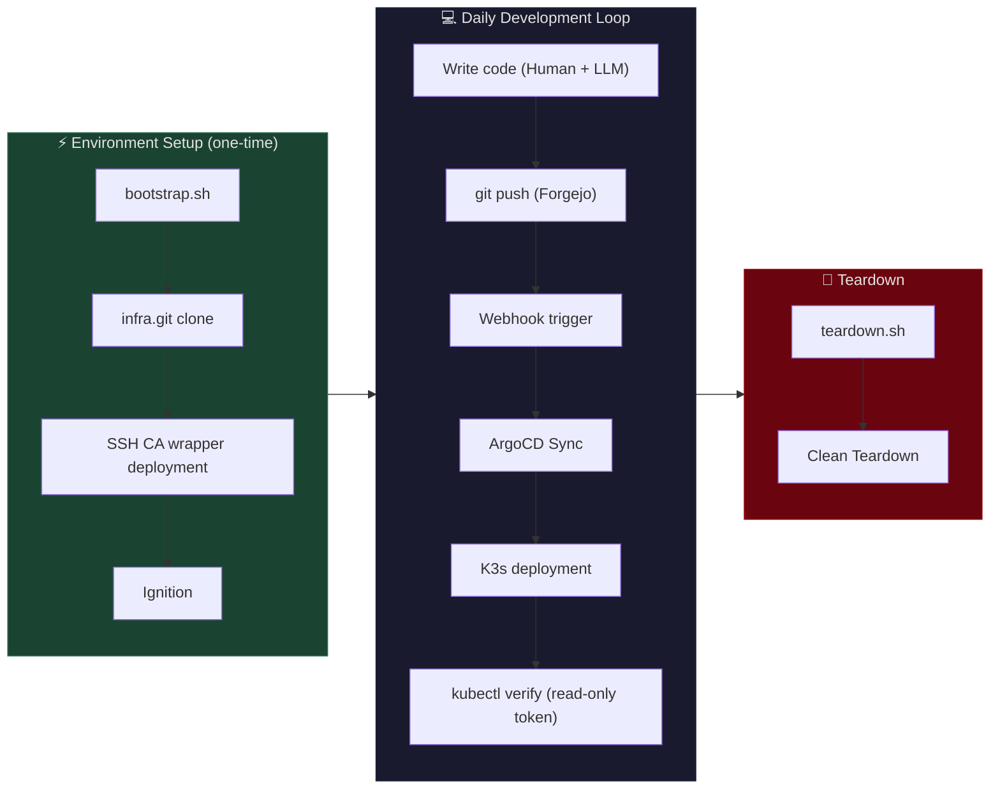

**🇰🇷 [한국어](README-ko.md)**

# 🗄️ caged-dev-env

> **A single-script K3s development environment that structurally prevents unintended system manipulation by AI agents**

Environment: Oracle Cloud Always-Free ARM instance (4 OCPU, 24 GB RAM) + Synology NAS (backup/storage)
Goal: Build a K3s infrastructure that operates securely over the public internet without a VPN. Grant LLM coding agents conditional access to infrastructure controls while structurally preventing unintended system manipulation.

> ⚠️ **This repository is a sanitized showcase version with all secrets removed.** The production codebase is managed on a self-hosted Forgejo instance. All placeholders (`<YOUR_...>`) are intentionally masked.

---

## 🚀 Quick Start

No USB drives or persistent configuration files needed. Just open a terminal on a fresh local machine. Bootstrap credentials (Vault address, RoleID, etc.) are retrieved from a password manager.

```bash
# Replace <YOUR_GITHUB_RAW_URL> with your own GitHub raw URL
curl -sL <YOUR_GITHUB_RAW_URL>/scripts/bootstrap.sh -o /tmp/bootstrap.sh
bash /tmp/bootstrap.sh
```

The script prompts for the following (auto-skipped if pre-set as environment variables):
1. **Vault server address** — Domain where OpenBao is running
2. **Forgejo address** — Self-hosted Git server
3. **Forgejo llm-bot token** — For HTTPS clone (one-time use, never stored)
4. **AppRole RoleID** — Vault authentication identifier for the LLM agent

Once inputs are provided, the script automatically:
- Detects OS and installs dependencies (bao CLI, kubectl, jq)
- Clones the infra repo via HTTPS (two-stage bootstrap that works without SSH CA)
- Generates SSH keypair (suggests ed25519-sk if YubiKey is detected)
- Deploys SSH CA wrappers (`ssh-admin`) and LLM-specific wrappers (`ssh-llm`)
- Deploys Vault Agent systemd unit
- Registers Git remotes (human `git-admin` + LLM-specific `git-llm`)
- Configures Git defaults (handles fresh machines with no prior config)
- OIDC authentication → ignition → issues 1-hour TTL dynamic K8s token
- Auto-issues LLM SSH CA certificate (`valid_principals: llm-agent,llm-bot`)
- **E2E automated verification**: kubectl access, RBAC denial, auth identity, git push dry-run (4/4 pass)

When done, run `teardown.sh` for a clean teardown.
A post-teardown audit automatically verifies no symlinks or dangling references remain.

---

## 🛡️ Core Design Principles

### 1. Separation of Structure and Secrets

Only the structure of manifests (YAML key names, Helm chart templates) is exposed to the LLM. Actual secret values are stored in OpenBao and injected at runtime by the ExternalSecret Operator as K8s Secrets. The LLM can see which keys an `ExternalSecret` manifest references but can never access the actual passwords or tokens. As a secondary defense layer, the LLM agent's ClusterRole blocks access to `secrets` resources via RBAC, preventing secret retrieval through the K8s API.

### 2. Separated Authentication Pipelines for Humans and Machines

```
Human:   Authelia OIDC → OpenBao login → SSH CA certificate → ssh-admin wrapper → server kubectl
Machine: AppRole (1h SecretID) → OpenBao token → K8s Secrets Engine → dynamic SA token → restricted K8s API
```

Human administrative tasks are performed directly on the server via SSH, so no admin kubeconfig exists on external workstations. The dynamic SA token issued to the LLM is bound to the `llm-agent-readonly` ClusterRole (read-only) and auto-expires after a 1-hour TTL.

For the LLM agent to access the K8s API, a human must first authenticate via OIDC and run the ignition script to inject a time-limited SecretID. This manual authorization design enforces that the M2M pipeline cannot activate without explicit human approval.

### 3. Least Privilege and Volatility

- K8s tokens exist only in `/dev/shm` (tmpfs) — never written to disk
- Unified 1-hour TTL across the entire auth chain (SecretID, Vault Token, K8s SA Token)
- SSH CA certificates: The LLM-specific role excludes `permit-port-forwarding` → blocks internal service pivoting
- Human SSH keys are owned by `root:root` — kernel-level prevention of LLM processes reading human credentials within the same OS user session
- The LLM agent connects to the server only through its dedicated SSH wrapper (`ssh-llm`) with restricted certificates. However, a prior incident showed the agent falling back to human SSH keys for full-privilege access when its dedicated path failed. To prevent this, `unshare --mount` renders human keys invisible to the LLM process, and `SSH_AUTH_SOCK` is removed to block SSH Agent-mediated access
- Initial bootstrap credentials (RoleID, Forgejo token) are delivered via out-of-band channels and do not persist locally after script execution
- The human's admin SSH CA certificate is deleted (`rm`) during normal operations to maintain least privilege. When infrastructure changes are needed, a 1-hour certificate is re-issued via OIDC authentication on demand (escalation model)

---

## 🏗️ System Architecture



### Development Workflow (CI/CD)



| Role | Tech Stack | Rationale |
|------|-----------|-----------|
| Orchestration | K3s | Single binary, ARM64 native, control plane + worker within 24 GB |
| Identity/SSO | Authelia | ~50 MB RAM, file-based GitOps-friendly, native Traefik ForwardAuth |
| Secret Mgmt | OpenBao (Vault fork) | MPL-2.0 open source, 100% Vault API compatible, dynamic secrets + SSH CA |
| GitOps | ArgoCD + Forgejo | Git as Single Source of Truth, instant Webhook sync on commit |
| Backup | Velero + Kopia + MinIO | K8s resource snapshots + S3-compatible storage, NAS replication |
| TLS | cert-manager | Let's Encrypt DNS-01 via Cloudflare, NAS certificate pull sync |

### Why K8s Instead of Docker Compose

Docker socket access provides no granular permission control (all-or-nothing). There is no way to enforce restrictions like "this agent can only read." K8s places an RBAC layer in front of its API, enabling per-agent permission separation at the namespace and verb (get/list/delete) level. RBAC was a prerequisite for granting LLM agents conditional access to infrastructure controls.

---

## 💥 Incident Learnings

Architecture corrections driven by real operational incidents.

| Incident | Summary | Correction |
|----------|---------|------------|
| Proactive defense against unintended LLM system manipulation | Structural flaw: LLM had unrestricted access without RBAC | Structural separation of schema and secrets + read-only ClusterRole |
| RBAC bypass via local admin kubeconfig | Admin kubeconfig coexisted with restricted tokens, allowing direct admin access | Isolated admin access via SSH wrapper (`ssh-admin`) + dynamic M2M pipeline + `root:root` SSH key ownership |
| LLM credential escalation via human SSH keys | Agent fell back to human keys for full-privilege access when dedicated auth path failed | `unshare --mount` namespace isolation + `root:root` file ownership + SSH Agent socket removal |
| K8s Secret Annotation plaintext leak | Plaintext secrets found in `last-applied-configuration` annotation during troubleshooting (Secondary Discovery) | Banned `kubectl apply` for secrets, full migration to ExternalSecret |
| Velero Restic silent backup failure | Lock contention caused backups to report success while actually failing | Migrated to Kopia engine + DB logical dump replication |

Each incident includes discovery context, root cause analysis, architecture correction, and recurrence prevention measures. See [`docs/incidents.md`](docs/incidents.md) for detailed analysis.

---

## 🚧 Known Limitations and Future Plans

- **Structural dependency on LLM IDE**: This architecture leverages LLM coding agents for repetitive infrastructure tasks such as Kustomize structure design and Ingress debugging. After evaluating major LLM IDEs including Claude Code, Antigravity was selected for its long-context retention and external tool integration (SSH/kubectl). However, any such tool depends on big-tech commercial services, meaning the LLM-based operational environment may become unviable due to service discontinuation or pricing changes. Core infrastructure (K3s, ArgoCD, OpenBao) operates independently without LLM, and alternatives are available given the competitive LLM IDE market.
- **Audit/Observability not yet implemented**: While privilege isolation (RBAC, TTL) constrains the blast radius of LLM-induced incidents, there is no black box for post-hoc tracking of "what commands the agent ran and what data it accessed during its allowed window." The accidental discovery of the Secret Annotation plaintext leak highlighted the risk of relying on luck rather than systematic audit logs. Integration of K8s API audit policies with OpenBao logs is planned.
- **LLM context pollution**: Observed behavioral drift where early-session privilege violations persisted in context as "successful precedents," causing the same patterns to repeat. Prompt-based rules degrade inversely with context length, confirming that OS-level enforcement (`unshare`) is essential.
- **Single node**: Control plane and worker run on the same node. A node failure takes down the entire cluster. Recovery relies on Velero backup-based restoration procedures.

---

## 📂 Repository Structure

```
caged-dev-env/
├── README.md                          # Project overview (English)
├── README-ko.md                       # 프로젝트 개요 (한국어)
├── configs/                           # Declarative config files (Vault, K8s RBAC, systemd)
│   ├── kubeconfig.ctmpl               #   Vault Agent → kubeconfig rendering template
│   ├── llm-agent-clusterrole.yaml     #   LLM agent read-only ClusterRole
│   ├── vault-agent.hcl                #   Vault Agent AppRole auto-auth config
│   └── vault-agent.service            #   systemd unit (daemon management)
├── scripts/                           # Executable scripts (bootstrap, auth, teardown)
│   ├── bootstrap.sh                   #   Single-script environment setup
│   ├── ignite-llm.sh                  #   LLM M2M auth pipeline ignition
│   ├── ssh-admin.sh                   #   Human SSH CA wrapper (OIDC → cert → connect)
│   ├── ssh-llm.sh                     #   LLM SSH CA wrapper (port-forwarding blocked)
│   └── teardown.sh                    #   Clean teardown
└── docs/                              # Operational documentation
    ├── incidents.md                   #   Incident analysis and architecture corrections
    ├── infrastructure.md              #   Infrastructure diagram
    └── tech-decisions.md              #   Technology selection rationale (trade-off analysis)
```
