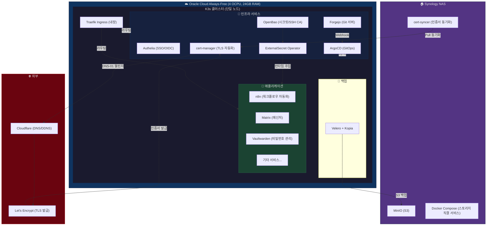

# 인프라 구성도 (Infrastructure Overview)

## 전체 구성



## 네트워크 흐름

```
인터넷 → Cloudflare (DNS/프록시) → Oracle Cloud 퍼블릭 IP
    → Traefik Ingress (K3s 내장)
        → Authelia ForwardAuth 미들웨어 (SSO 게이트)
            → 각 서비스 (인증 통과 시)
```

## 하이브리드 구성 (K3s + NAS)

| 위치 | 역할 | 이유 |
|------|------|------|
| K3s (Cloud) | 모든 컨테이너 오케스트레이션, RBAC, GitOps | K8s API 기반 권한 분리 필요 |
| NAS (Docker Compose) | MinIO, 스토리지 직결 서비스 | S3 백업 수신, 디스크 I/O 성능 |
| NAS → K3s | cert-syncer가 인증서를 Pull | NAS 방화벽 인바운드 개방 불필요 |
